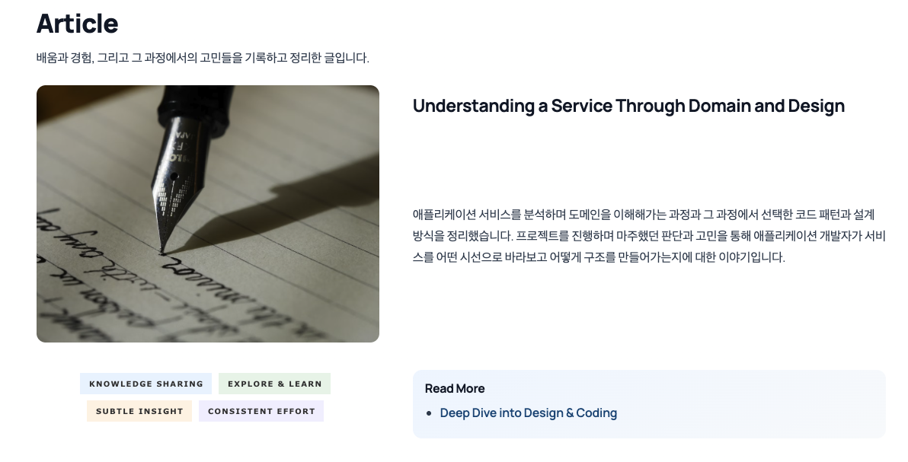
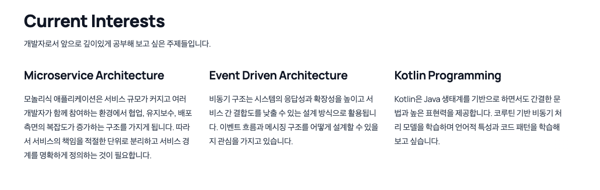
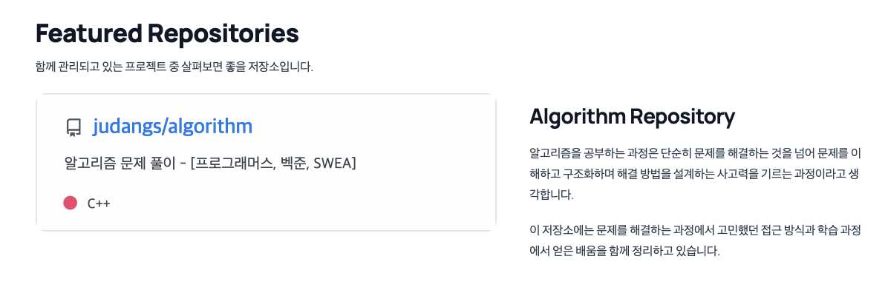
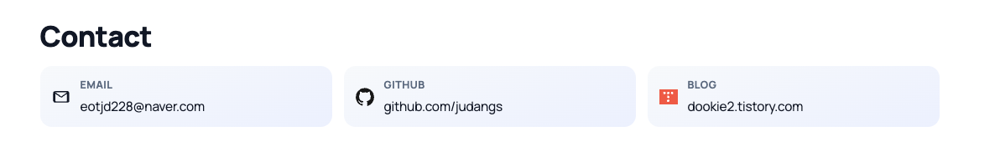

 

  

<h1>About</h1>

  Spring 기반 애플리케이션 개발을 중심으로 백엔드 시스템을 설계하고
  개발하는 일을 하고 있습니다. 객체지향 설계를 바탕으로 애플리케이션
  서비스 구조와 아키텍처를 어떻게 구성할 것인지에 관심이 많으며, 시스템이
  점점 복잡해지더라도 유지보수 가능성과 확장성을 유지할 수 있는 코드
  구조를 만드는 것을 중요하게 생각합니다.

  이해한 도메인을 어떻게 모델링하고 코드 구조로 표현할 것인지를 꾸준히
  고민하며 개발하고 있습니다. 도메인 중심 설계와 책임 기반 구조를 통해
  안정적인 서비스 레이어를 구성하고, 장기적으로 운영 가능한 시스템을
  만드는 것을 목표로 합니다.

 

# Service

<strong>Key Focus</strong>

 

 

<h3>Project Links</h3>

  
  <strong>Service</strong>
  <a width=100px href="https://payvue.it.com">https://payvue.it.com</a>

  
  <strong>Repo</strong>
  <a width=100px href="https://github.com/payvue">https://github.com/payvue</a>

  
  <strong>Article</strong>
  <a width=100px href="https://dookie2.tistory.com/"
    >https://dookie2.tistory.com/</a
  >

 

  
<strong>Concept                         </strong>

  

    이 서비스는 개인 자산 관리와 그룹 기반 재테크 활동을 하나의 흐름에서 다룰 수 있도록 
    설계된 핀테크 웹 애플리케이션입니다.
  

  

    공동 지출이나 그룹 정산이 필요한 상황에서는 여전히 메신저나 수작업에 의존하는 경우가 많습니다.
    이 프로젝트는 이러한 불편함을 줄이고, 개인 금융 활동과 함께 사용하는 돈의 흐름을
    하나의 서비스 안에서 자연스럽게 연결하는 것을 목표로 합니다.
  

  

    사용자는 자신의 자산 현황과 거래 흐름을 확인하고 결제나 송금을 진행할 수 있으며,
    그룹 기능을 통해 공동 지출 상황에서 결제 요청을 생성하고 구성원과 상태를 공유할 수 있습니다.
  

  

  

  

  

